# 🎙️ PolyNote - Multilingual Note-Taking Agent

[](https://python.org)
[](https://streamlit.io/)
[](https://fastapi.tiangolo.com/)
[](https://www.assemblyai.com/)
[](https://groq.com/)
[](https://www.langchain.com/)

A powerful AI-powered application that transcribes, summarizes, and extracts action items from multilingual audio/video content. Built with FastAPI and Streamlit, it provides an intuitive interface for processing and analyzing spoken content.

## 🌟 Features

- **Multilingual Transcription**: Convert audio/video content to text in multiple languages
- **Smart Summarization**: Generate concise summaries of conversations and meetings
- **Action Item Extraction**: Automatically identify and extract action items from discussions
- **Interactive Chat**: Chat with your transcript using AI-powered context-aware responses
- **Modern UI**: Beautiful and responsive interface built with Streamlit
- **File Export**: Export transcripts, summaries, and action items in text format
- **Real-time Processing**: Fast and efficient processing of audio/video content

## 🎥 Demonstration

### Screenshots

#### Main Interface

*The main interface showing the file upload and transcription area*

#### Transcription View

*Real-time transcription display with speaker detection*

#### Summary and Action Items

*Generated summary and extracted action items*

#### Chat Interface

*Interactive chat interface for querying the transcript*

## 🏗️ Architecture

The application follows a modern microservices architecture:

```mermaid
graph TD
    A([👤 User]) -- Interacts via Browser --> B[🖥️ Streamlit Frontend]
    B -- 🎧 /transcribe (Audio File) --> C{⚙️ FastAPI Backend}
    B -- 📝 /summarize (Transcript) --> C
    B -- 📋 /extract-action-items (Transcript) --> C
    B -- 💬 /chat (Transcript + Query) --> C
    C -- ⬆️ Upload Audio / Get Transcript --> D[🧠 AssemblyAI API]
    C -- 🔁 Summarize / Extract / Chat --> E[🤖 Groq API via LangChain]
    D -- 📄 Transcription Result --> C
    E -- 🧠 LLM Response --> C
    C -- 📦 API Response (JSON) --> B
    B -- 🔍 Search Keyword --> B
    B -- 📤 Export TXT --> A
    B -- 📊 Displays Results --> A
```



## 🛠️ Tech Stack


### Key Technologies:

- **Frontend**: Streamlit - Modern, interactive web interface
- **Backend**: FastAPI - High-performance Python web framework
- **ASR**: AssemblyAI - State-of-the-art speech recognition
- **LLM**: Groq - Fast and efficient language model inference
- **Framework**: LangChain - LLM application development framework

## 🚀 Setup and Installation

1. **Clone the repository**
   ```bash
   git clone https://github.com/yourusername/Multilingual-Note-Taking-Agent.git
   cd Multilingual-Note-Taking-Agent
   ```

2. **Create and activate virtual environment**
   ```bash
   python -m venv .venv
   source .venv/bin/activate  # On Windows: .venv\Scripts\activate
   ```

3. **Install dependencies**
   ```bash
   pip install -r requirements.txt
   ```

4. **Configure environment variables**
   Create a `.env` file with:
   ```
   ASSEMBLYAI_API_KEY=your_assemblyai_key
   GROQ_API_KEY=your_groq_key
   ```

5. **Start the backend server**
   ```bash
   cd src
   PYTHONPATH=$PYTHONPATH:. python -m uvicorn main:app --host 0.0.0.0 --port 8002 --reload
   ```

6. **Start the frontend**
   ```bash
   streamlit run streamlit_app.py
   ```

## 📖 Usage

1. **Upload Audio/Video**
   - Click the upload button in the sidebar
   - Select your audio/video file
   - Supported formats: mp3, wav, m4a, ogg, mp4, webm, mov, flac, mkv

2. **Transcribe**
   - Click "Transcribe Audio" to start transcription
   - View the transcript in real-time

3. **Summarize**
   - Click "Summarize Notes" to generate a summary
   - View extracted action items

4. **Chat**
   - Use the chat interface to ask questions about the transcript
   - Get AI-powered responses based on the content

5. **Export**
   - Download the complete notes including transcript, summary, and action items

## 📁 Project Structure

```
Multilingual-Note-Taking-Agent/
├── src/
│   ├── api/
│   │   └── endpoints/         # API route handlers
│   ├── core/
│   │   └── config.py         # Configuration and settings
│   ├── schemas/
│   │   └── transcription.py  # Data models
│   └── services/
│       └── transcription_service.py  # Business logic
├── temp_audio/               # Temporary audio storage
├── .env                      # Environment variables
├── requirements.txt          # Project dependencies
├── streamlit_app.py         # Frontend application
└── LICENSE                  # MIT License
```

## 🔍 Codebase Explanation

### Backend (FastAPI)

- **API Endpoints**:
  - `/api/v1/transcribe`: Handles audio/video file upload and transcription
  - `/api/v1/llm/summarize`: Generates summaries from transcripts
  - `/api/v1/llm/extract-action-items`: Extracts action items
  - `/api/v1/llm/chat`: Handles chat interactions

- **Core Services**:
  - Transcription service using AssemblyAI
  - LLM integration with Groq
  - File management and cleanup

### Frontend (Streamlit)

- **User Interface**:
  - File uploader with drag-and-drop support
  - Real-time transcription display
  - Interactive chat interface
  - Summary and action items display
  - Export functionality

## 📄 License

This project is licensed under the MIT License - see the [LICENSE](LICENSE) file for details.

## 🤝 Contributing

Contributions are welcome! Please feel free to submit a Pull Request.

## 📞 Support

For support, please open an issue in the GitHub repository.
